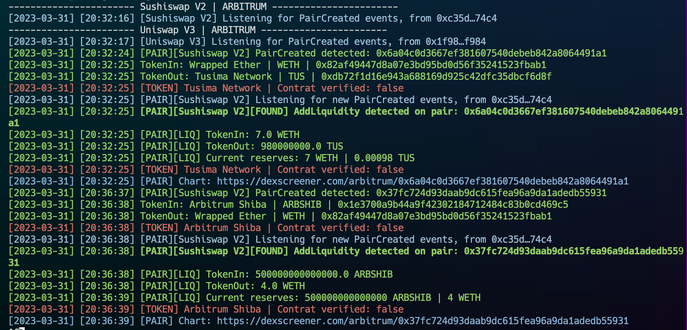
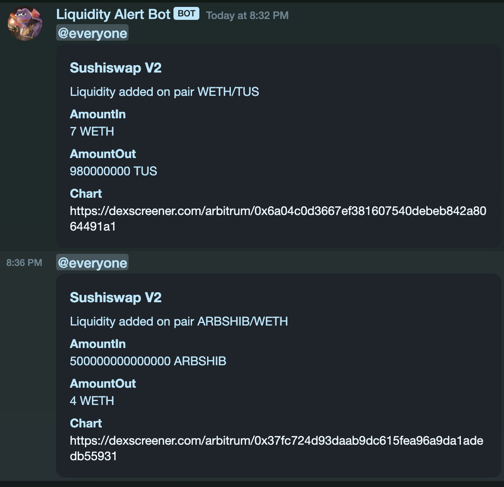

### Liquidity trackor

*It is a bot written in rust allowing to stream the new LPs created as well as the liquidity additions on them. A Discord webhook can be use to have alerts on your own server*

#### Setup
##### Requirements
- [Rust and Cargo](https://win.rustup.rs/)

Copy the `.env.example` file and rename it to `.env`. Fill the variables with your own values.

##### Supported chains
- Ethereum
- Arbitrum
- Polygon
- Bsc
- Fantom
- Avalanche
- Cronos

A json file is already present containing the contract addresses of several dex on different EVM blockchains. You can add your own by following the same format, you just need to add the dex name and its factory and router contract address.

##### Options
- `--chain` : The chain you want to track. Default is `ethereum`
- `--json` : The path to the json file containing the contracts addresses. Default is `src/json/dex_contracts.json`
- `--block` : Monitor the block creation. Default is `false`

#### Run
```bash
cargo run -- --chain arbitrum
```




#### TODO
- [ ] UniV3 support
- [ ] Get the dex name from the json file


#### Credits
This bot is based on top of the Rust MEV template by [Degatchi](https://github.com/degatchi/mev-template-rs)